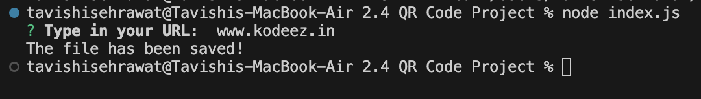

<h1 align="center">QR-Code Generator</h1>
QR Code generator using Node.js, NPM Package Manager and installing external node modules.
Using Node to generate QR codes for URLs.

Step 1 :
Download the code and open the files on your VSC.

Step 2 :
CD into the qr-code directory and install the npm module using the command
npm i
then run the following command:
node index.js

Step 3 :
Type in your URl
You should see the message "The file has been saved!"

Step 4 :
Open the qr_image.png to get your generated qr code for the url in URL.txt

